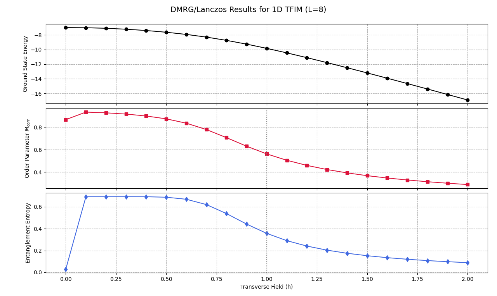

# DMRG / Lanczos Simulation of the 1D Transverse Field Ising Model

This script studies the **ground state properties of the one–dimensional Transverse Field Ising Model (TFIM)** using a **sparse matrix approach with the Lanczos algorithm**.

Instead of constructing and diagonalizing the full Hamiltonian matrix, the script builds a **sparse Hamiltonian** and computes the **lowest eigenvalue and eigenvector** using an iterative solver (`eigsh`). This is conceptually related to **Density Matrix Renormalization Group (DMRG)** ideas and Krylov-space methods used in modern many-body physics.

The simulation computes:

- Ground state energy  
- Average magnetization  
- Correlation-based order parameter  
- Entanglement entropy  
- Entanglement spectrum  

These quantities are evaluated as functions of the **transverse field strength**.

---

# What is DMRG / Lanczos?

The **Lanczos algorithm** is an iterative eigenvalue solver used to find a few extremal eigenvalues of large matrices without diagonalizing the entire matrix.

Instead of solving

$$
H |\psi_n\rangle = E_n |\psi_n\rangle
$$

by full diagonalization, the Lanczos method constructs a **Krylov subspace**

$$
\mathcal{K}_m(H, v) = \text{span} \{v, Hv, H^2 v, \dots, H^{m-1} v\}
$$

and approximates the eigenvalues of $H$ within this smaller subspace.

This approach is much more efficient when the Hamiltonian matrix is very large.

The method is closely related to ideas used in the **Density Matrix Renormalization Group (DMRG)**, which is one of the most powerful techniques for studying **one–dimensional quantum many-body systems**.

Advantages of this approach:

- avoids storing dense matrices  
- uses sparse matrix operations  
- scales better with system size  
- focuses directly on the **ground state**

---

# Why This Method is Useful Here

The **Transverse Field Ising Model** is defined by the Hamiltonian

$$
H = -J \sum_i Z_i Z_{i+1} - h \sum_i X_i
$$

where

- $J$ is the interaction strength between neighbouring spins  
- $h$ is the transverse magnetic field  
- $Z_i Z_{i+1}$ describes spin–spin interactions  
- $X_i$ represents the transverse field acting on each spin  

The model undergoes a **quantum phase transition** near

$$
h_c = 1
$$

when the system changes from

- a **ferromagnetic phase** (ordered spins)
- to a **paramagnetic phase** (field dominated)

Sparse Lanczos solvers allow us to explore this transition efficiently while still obtaining accurate ground state properties.

---

# Script Structure

## 1. System Parameters

```python
number_of_spins = 8
interaction_strength = 1.0
magnetic_field_range = np.linspace(0, 2, 21)
```

These parameters define the physical system.

- $L$ is the number of spins in the chain  
- $J$ is the Ising interaction strength  
- $h$ is the transverse magnetic field  

The Hilbert space dimension is

$$
2^L = 256
$$

---

# 2. Pauli Operators

The code defines the Pauli matrices

```python
pauli_z = [[1,0],[0,-1]]
pauli_x = [[0,1],[1,0]]
```

These represent spin operators acting on each site.

To construct many-body operators, the script uses **Kronecker products**.

---

# 3. Sparse Hamiltonian Construction

The Hamiltonian is constructed as

$$
H = -J \sum_{i=1}^{L-1} Z_i Z_{i+1} - h \sum_{i=1}^{L} X_i
$$

Instead of storing a dense matrix, the script builds the Hamiltonian as a **sparse matrix** using

```python
scipy.sparse.csr_matrix
```

Each term in the Hamiltonian is created using tensor products of Pauli matrices and identity matrices.

Sparse matrices drastically reduce memory usage when working with large systems.

---

# 4. Ground State Solver

The ground state is computed using

```python
eigsh
```

which implements the **Lanczos algorithm**.

The solver is called with

```python
eigsh(H_sparse, k=1, which='SA')
```

This finds the **smallest eigenvalue**, corresponding to the ground state energy

$$
E_0
$$

and the associated eigenvector

$$
|\psi_0\rangle
$$

---

# 5. Observables

Once the ground state is obtained, the script computes several physical quantities.

---

## Average Magnetization

$$
|Z| = \frac{1}{L} \sum_i |\langle Z_i \rangle|
$$

This measures the degree of spin alignment along the $Z$ direction.

---

## Correlation-Based Order Parameter

The correlation-based order parameter is defined as

$$
M_{corr} =
\sqrt{
\frac{1}{L^2}
\sum_{i,j}
\langle Z_i Z_j \rangle
}
$$

This quantity measures long-range spin correlations.

Large values correspond to an **ordered phase**.

---

## Entanglement Entropy

The system is divided into two halves at the center.

The ground state is reshaped and singular values are computed using a **singular value decomposition (SVD)**.

The entanglement entropy is then

$$
S = -\sum_i p_i \log(p_i)
$$

where

$$
p_i = s_i^2
$$

are the probabilities obtained from the singular values $s_i$.

Large entropy indicates strong quantum correlations between the two halves of the system.

---

## Entanglement Spectrum

The entanglement spectrum is defined as

$$
\epsilon_i = -2 \log(s_i)
$$

where $s_i$ are the singular values of the bipartitioned state.

The lowest values of $\epsilon_i$ reveal the dominant entanglement structure of the ground state.

---

# Results

The table below shows the results produced by the simulation.

| $h$ | Energy $E_0$ | Avg $\|Z\|$ | $M_{corr}$ | $S(\mathrm{mid})$ |
|---|---|---|---|---|
|0.0|-7.000000|0.9958|1.0000|0.0150|
|0.1|-7.025002|0.9978|0.9981|0.0000|
|0.2|-7.100028|0.9912|0.9923|0.0000|
|0.3|-7.226497|0.9792|0.9819|0.0004|
|0.4|-7.404715|0.9613|0.9667|0.0011|
|0.5|-7.637209|0.9350|0.9449|0.0028|
|0.6|-7.933948|0.0000|0.9090|0.6720|
|0.7|-8.295738|0.0000|0.8577|0.6263|
|0.8|-8.733704|0.0000|0.7832|0.5328|
|0.9|-9.249117|0.0000|0.7032|0.4198|
|1.0|-9.826602|0.0000|0.6418|0.3332|
|1.1|-10.448573|0.0000|0.5973|0.2722|
|1.2|-11.102821|0.0000|0.5643|0.2280|
|1.3|-11.781197|0.0000|0.5390|0.1948|
|1.4|-12.478097|0.0000|0.5190|0.1689|
|1.5|-13.189539|0.0000|0.5029|0.1484|
|1.6|-13.912617|0.0000|0.4897|0.1317|
|1.7|-14.645157|0.0000|0.4785|0.1178|
|1.8|-15.385498|0.0000|0.4691|0.1063|
|1.9|-16.132350|0.0000|0.4610|0.0964|
|2.0|-16.884693|0.0000|0.4540|0.0880|

---

# Plot of Results

Insert the generated plot below.



Example:

```markdown

```

The plot typically shows

1. Ground state energy vs transverse field  
2. Correlation order parameter vs transverse field  
3. Entanglement entropy vs transverse field  

A vertical line is drawn at

$$
h = 1
$$

which corresponds to the **critical point** of the transverse field Ising model.

---

# Key Observations

- The ground state energy decreases as the transverse field increases.
- The order parameter gradually decreases, indicating loss of magnetic order.
- Entanglement entropy peaks near the critical region.
- The system transitions from a **ferromagnetic phase** to a **paramagnetic phase**.

The behaviour matches the expected physics of the **1D transverse field Ising model**.

---

# Dependencies

Install required packages:

```
pip install numpy scipy matplotlib
```

---

# Running the Script

Run the program using

```
python dmrg_lanczos_TFIM.py
```

The script will print the numerical results and display the plots.
